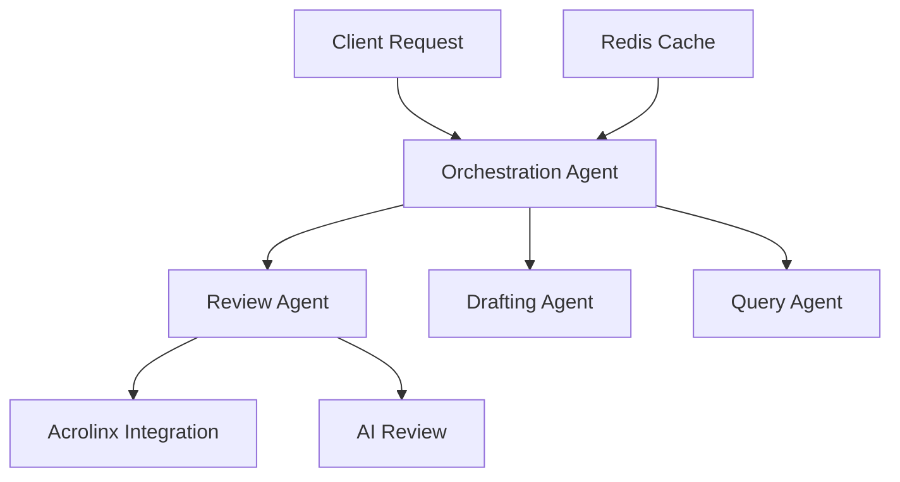

# AI Documentation System Developer Guide

## Architecture Overview

### Components
1. **Core Agents**
   - Review Agent
   - Drafting Agent
   - Query Response Agent
   - Acrolinx Agent
   - Orchestration Agent

2. **Utilities**
   - Redis Client
   - Error Handler
   - Performance Monitor
   - Documentation Generator

### System Flow


## Development Setup

### Prerequisites
1. Python 3.8+
2. Redis Server
3. API Keys:
   - OpenAI
   - Acrolinx
   - Other integrations

### Installation
```bash
# Clone repository
git clone <repository-url>

# Create virtual environment
python -m venv venv
source venv/bin/activate  # Linux/Mac
venv\Scripts\activate     # Windows

# Install dependencies
pip install -r requirements.txt

# Configure environment
cp .env.example .env
# Edit .env with your settings
```

## Testing

### Running Tests
```bash
# Run all tests
pytest

# Run specific test categories
pytest tests/test_agents/
pytest tests/test_utils/

# Run with coverage
pytest --cov=src
```

### Writing Tests
1. Follow existing test structure
2. Include unit and integration tests
3. Mock external dependencies
4. Test error cases
5. Add performance tests for critical paths

## Error Handling

### Guidelines
1. Use centralized error handler
2. Categorize errors appropriately
3. Include context in error reports
4. Implement recovery strategies
5. Log all errors

### Example
```python
try:
    result = await agent.process()
except Exception as e:
    await error_handler.handle_error(
        e,
        context={"component": "agent", "operation": "process"},
        severity=ErrorSeverity.HIGH
    )
```

## Performance Monitoring

### Key Metrics
1. Response times
2. Resource usage
3. Cache hit rates
4. Error rates
5. API latencies

### Implementation
```python
async with performance_monitor.track("operation_name"):
    # Your code here
    pass
```

## Contributing

### Process
1. Fork repository
2. Create feature branch
3. Write tests
4. Implement changes
5. Submit pull request

### Code Style
- Follow PEP 8
- Use type hints
- Document all functions
- Keep functions focused
- Write clear commit messages 